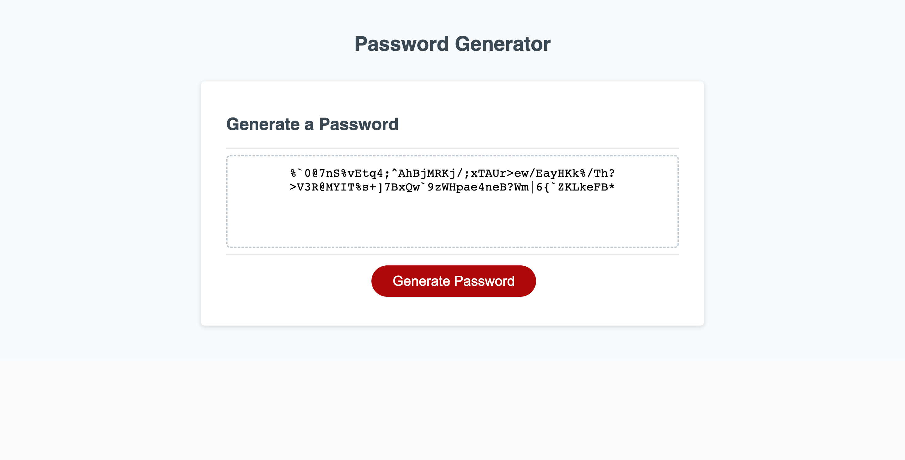

# 03 JavaScript: Password Generator

## Access

https://cl-czayas.github.io/module-3-challenge/

## Description

This website was created in order to generate a random password as per the user's specifications.

## Usage

After accessing the webpage, users click the 'generate password' button & anser the corresponding prompts in order to generate a random password. 

## Screenshot

## Credits

Code refactored by Christopher L. Cristóbal Zayas (cl-czayas).